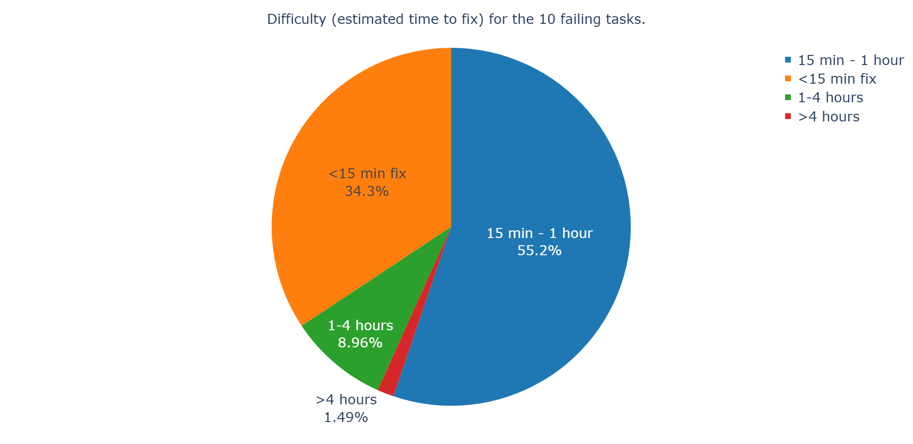
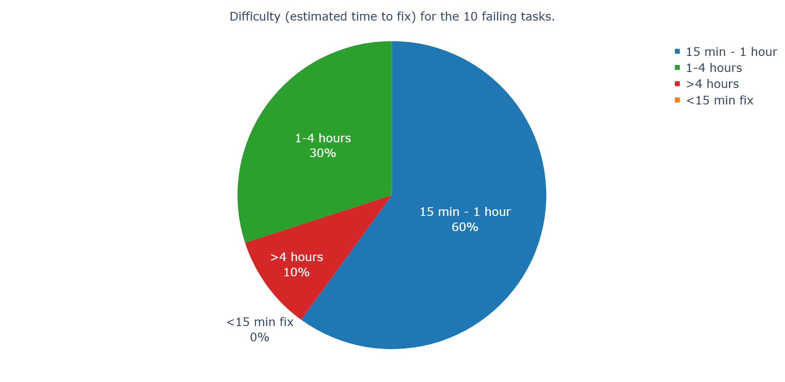

# Testing Example
For research purposes, we tested our pipeline with 67 tasks (all tasks from "matplotlib__matplotlib-26291" to "scikit-learn__scikit-learn-10844"), which we selected in the middle of the SWE-bench verified dataset to cover a wide variety of different tasks. After we ran everything, we then decided to have a closer look at all tasks where qwen3-coder, Deepseek and Claude-Sonnet4 failed (we excluded tasks where the pipeline itself failed, i.e., where no patch was produced due to things like architectural issues of a package). There were ten tasks in total for which this was the case. For each of these tasks, we manually looked through the provided description in the dataset and also analyzed the test failures in the logs provided by the SWE-bench evaluation.

The table below, as well as the linked documents document our results from this manual checks.
# Failure Checklist
   
|                                                      Task |         Model | Environment Failure | Test Failure | Pass to Pass | Fail to Pass | Pass to Fail | Fail to Fail |
|:----------------------------------------------------------|:--------------|:--------------------|:-------------|:-------------|:-------------|:-------------|:-------------|
|       [mwaskom\_\_seaborn-3187](mwaskom__seaborn-3187.md) |          qwen |                   0 |            2 |            0 |            2 |            0 |            0 |
|                                                           |      deepseek |                   0 |            2 |            0 |            2 |            0 |            0 |
|                                                           | claude-sonnet |                   0 |            2 |            0 |            2 |            0 |            0 |
|             [psf\_\_requests-6028](psf__requests-6028.md) |          qwen |                   0 |            2 |            0 |            2 |            0 |            0 |
|                                                           |      deepseek |                   0 |            2 |            0 |            2 |            0 |            0 |
|                                                           | claude-sonnet |                   0 |            2 |            0 |            2 |            0 |            0 |
|           [pydata\_\_xarray-6992](pydata__xarray-6992.md) |          qwen |                   0 |           12 |            0 |           12 |            0 |            0 |
|                                                           |      deepseek |                   0 |           12 |            0 |           12 |            0 |            0 |
|                                                           | claude-sonnet |                   0 |           12 |            0 |           12 |            0 |            0 |
|           [pydata\_\_xarray-7229](pydata__xarray-7229.md) |          qwen |                   0 |            1 |            0 |            1 |            0 |            0 |
|                                                           |      deepseek |                   0 |            1 |            0 |            1 |            0 |            0 |
|                                                           | claude-sonnet |                   0 |            1 |            0 |            1 |            0 |            0 |
|   [pylint-dev\_\_pylint-6386](pylint-dev__pylint-6386.md) |          qwen |                   0 |            8 |            7 |            1 |            0 |            0 |
|                                                           |      deepseek |                   0 |            1 |            0 |            1 |            0 |            0 |
|                                                           | claude-sonnet |                   0 |            1 |            0 |            1 |            0 |            0 |
|   [pylint-dev\_\_pylint-7080](pylint-dev__pylint-7080.md) |          qwen |                   0 |            1 |            0 |            1 |            0 |            0 |
|                                                           |      deepseek |                   0 |            1 |            0 |            1 |            0 |            0 |
|                                                           | claude-sonnet |                   0 |            1 |            0 |            1 |            0 |            0 |
|   [pylint-dev\_\_pylint-8898](pylint-dev__pylint-8898.md) |          qwen |                   0 |            2 |            1 |            1 |            0 |            0 |
|                                                           |      deepseek |                   0 |            2 |            1 |            1 |            0 |            0 |
|                                                           | claude-sonnet | ModuleNotFoundError |            0 |            0 |            0 |            0 |            0 |
| [pytest-dev\_\_pytest-10356](pytest-dev__pytest-10356.md) |          qwen |                   0 |            1 |            0 |            1 |            0 |            0 |
|                                                           |      deepseek |                   0 |            1 |            0 |            1 |            0 |            0 |
|                                                           | claude-sonnet |                   0 |            1 |            0 |            1 |            0 |            0 |
|   [pytest-dev\_\_pytest-5840](pytest-dev__pytest-5840.md) |          qwen |                   0 |            2 |            0 |            2 |            0 |            0 |
|                                                           |      deepseek |                   0 |            2 |            0 |            2 |            0 |            0 |
|                                                           | claude-sonnet |                   0 |            2 |            0 |            2 |            0 |            0 |
|   [pytest-dev\_\_pytest-6197](pytest-dev__pytest-6197.md) |          qwen |                   0 |            4 |            4 |            0 |            8 |            0 |
|                                                           |      deepseek |                   0 |            2 |            0 |            2 |            0 |            0 |
|                                                           | claude-sonnet |                   0 |            3 |            3 |            0 |            0 |            0 |

# Findings
## Difficulty correlations
Within the 67 samples that we tested, the difficulty distribution looked like this:

Among the 10 tasks where all LLMs failed, the distribution looked like this:

As can be seen, there is a considerable overrepresentation of difficult tasks among those that failed. Hence, we can identify a correlation between difficult tasks and LLMs failing. On the other hand, we can also observe that among the third of tasks that were deemed easy to fix (< 15 min fix), the LLMs solved everything correctly and of the 15 min to 1 hour tasks, it still solved the vast majority of them correctly.

To us, this indicates that LLMs seem to perform really good at easy tasks, relatively good at slightly more difficult tasks, and tend to performe bad on harder tasks.

## The challenges for LLMs
The first challenge for any LLM when tasked with producing a patch is to understand the underlying issue and what is expected. Within our 10 failing tasks, there was at least one instance where a flawed understanding of the task description seemed to be the root cause of the failure, namely in pylint-dev__pylint-8898. In this task, the LLM was supposed to fix a regex issue, where the presence of a comma produced an error. The LLMs tried to fix this by splitting the regex at the comma, which did remove the comma, but caused the regex to be cut off early, producing another error. In a way, the LLM did remove the comma, only the way it removed it wasn't suited for the context of the task.

Apart from issues with the task description, the most common issue seemed to be coding error within the patch of the LLMs. Whether these issues are actually still a result of a poor task understanding or bad training is hard to tell and more research is likely required.